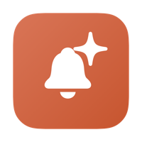
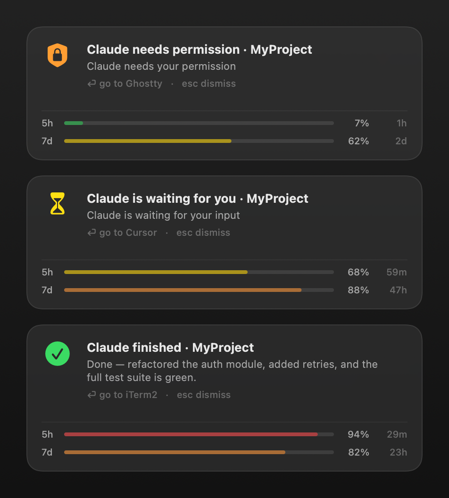
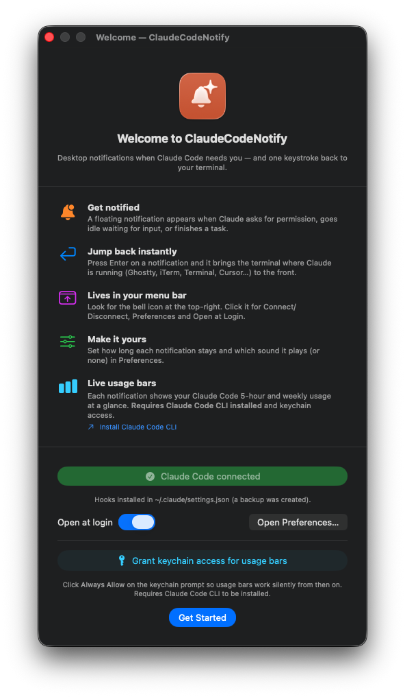
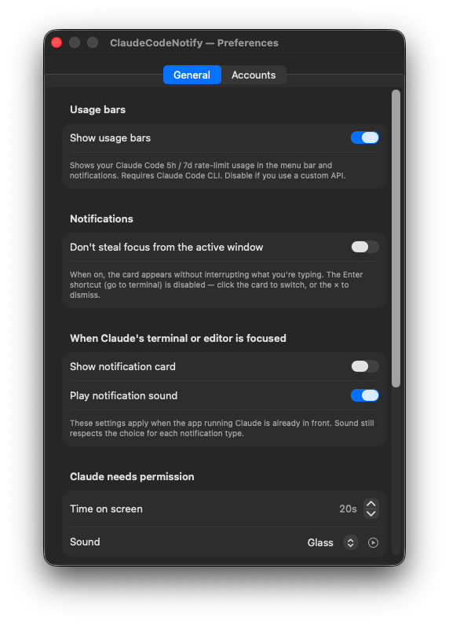
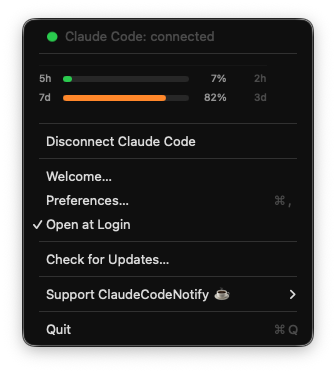

<p align="center">
  
</p>

<h1 align="center">ClaudeCodeNotify</h1>

<p align="center">
  Desktop notifications when Claude Code needs you —<br>
  <b>one keystroke back to your terminal.</b>
</p>

<p align="center">
  
  
  <a href="https://claudecodenotify.narlei.com"></a>
</p>

<p align="center">
  
</p>

A macOS **menu bar** app that pops a **floating notification in the center of your screen** when Claude Code needs you — when it **asks for permission**, is **idle waiting for input**, or **finishes a task**. Press **Enter** (or click) and it jumps you straight to the terminal where Claude is running. Built for people who leave Claude Code working and don't want to babysit the terminal.

> **It's a notifier, not a gatekeeper.** It doesn't block tools or decide permissions — you still approve/deny in the terminal. It just makes sure you *notice* and gets you there fast.

<p align="center">
  🌐 <a href="https://claudecodenotify.narlei.com"><b>claudecodenotify.narlei.com</b></a>
</p>

## Contents

- [How it works](#how-it-works)
- [Features](#features)
- [Screenshots](#screenshots)
- [Installation](#installation)
- [First launch](#first-launch)
- [Build (development)](#build-development)
- [Distribution](#distribution)
- [Support](#support)

## How it works

```
Claude Code (terminal)
  │  Notification hook (permission / idle)  +  Stop hook (task finished)
  ▼
bridge.sh ── POST (127.0.0.1 + token, fire-and-forget) ──►  ClaudeCodeNotify (menu bar, always on)
                                                              │ shows a floating notification, on top of everything
  press Enter / click ────────────────────────────────────────┘ → brings the terminal where Claude runs to the front
```

When shown, the notification appears centered at the top, over anything (including fullscreen apps), and captures the keyboard so a single **Enter** takes you to Claude. **Esc**, a click, or the per-type timeout dismisses it. Nothing is blocked — Claude keeps showing its native prompt in the terminal; this just gets you there.

## Features

- **🔔 Three event types**, each with its own icon and color:
  - 🟠 Claude needs permission
  - 🟡 Claude is idle (waiting for input)
  - 🟢 Claude finished the task (shows a short summary)
- **↵ Enter → jump to the terminal** — detects the host app (Ghostty, iTerm, Terminal, Cursor, VS Code, WezTerm, …) via `$TERM_PROGRAM` and brings it to the front.
- **🎚️ Make it yours** — per-type **duration** (`0` = stays until dismissed) and **sound** (system sounds or none, with preview); plus how the card/sound behaves while Claude's terminal or editor is already focused.
- **📊 Lives in your menu bar** — a bell icon with a green/red connection dot; connect or disconnect anytime. No Dock icon.
- **⚡ Live usage bars** — every notification and the menu show your Claude Code **5-hour rolling** and **weekly** usage, color-coded (green → yellow → orange → red) with a reset countdown. Reads your OAuth token directly from the macOS Keychain — no API key needed. Requires the Claude Code CLI to be installed.
- **🔒 Local & private** — a tiny server listening only on `127.0.0.1`, validated with a token. Nothing leaves your machine.
- **🚀 Open at Login** via `SMAppService`.

## Screenshots

<table>
  <tr>
    <td width="50%" valign="top">
      <br>
      <sub><b>Onboarding</b> — walks you through setup and confirms the connection.</sub>
    </td>
    <td width="50%" valign="top">
      <br>
      <sub><b>Preferences</b> — tune display time and sound for each notification type.</sub>
    </td>
  </tr>
</table>

<p align="center">
  <br>
  <sub><b>Menu bar</b> — connection status, live usage bars, preferences, and check for updates.</sub>
</p>

## Installation

Requires **macOS 13+** on **Apple Silicon**.

### Option 1: Homebrew (Recommended)

The easiest way to install and avoid Gatekeeper (quarantine) warnings:

```bash
brew install narlei/tap/claudecodenotify
```

### Option 2: Manual Download

1. Download and open the latest [`ClaudeCodeNotify.dmg`](../../releases/latest/download/ClaudeCodeNotify.dmg).
2. Drag `ClaudeCodeNotify.app` into your **Applications** folder.
3. **First launch** — the app is **unsigned** (no paid Apple account), so macOS blocks a double-click once. Do it once:
   - **right-click** the app → **Open** → **Open** in the dialog; or
   - in a terminal: `xattr -dr com.apple.quarantine /Applications/ClaudeCodeNotify.app && open /Applications/ClaudeCodeNotify.app`
4. A **bell icon** appears in the menu bar. Click it → **Connect Claude Code** (installs the hooks in `~/.claude/settings.json`, with an automatic backup).
5. Optional: **Open at Login** to start it with your system.

To stop it: **Disconnect Claude Code** in the menu.

## First launch

On first launch a **welcome screen** explains how it works and lets you **Connect Claude Code**, toggle **Open at Login**, and open **Preferences** right away. Reopen it anytime from the menu (**Welcome…**).

Everything lives in the **menu bar** (the bell icon). The menu shows a **green/red dot** for the connection status, plus Connect/Disconnect, Welcome, Preferences, Check for Updates, and Open at Login.

> The app generates a token on first run and writes `bridge.sh` to `~/.ccnotify/`; its store (token, port, preferences) lives in `~/Library/Application Support/ClaudeCodeNotify/`. Everything is local and only listens on `127.0.0.1`.

## Build (development)

Requires the Xcode/Swift toolchain. Everything goes through the `Makefile`:

```bash
make build      # compile (swift build)
make app        # assemble ClaudeCodeNotify.app (Info.plist + icon + ad-hoc sign)
make install    # build and open the app — then use the menu "Connect Claude Code"
make zip        # package into dist/ClaudeCodeNotify-<version>.zip
make dmg        # build a drag-to-Applications dist/ClaudeCodeNotify.dmg
make uninstall  # remove the hooks from ~/.claude/settings.json (with backup)
make help       # list all targets
```

`make dmg` uses [`dmgbuild`](https://pypi.org/project/dmgbuild/) (installed by `make setup`) to build the styled disk image headlessly — no Finder automation needed. `Scripts/make-icon.sh` regenerates `Resources/AppIcon.icns` when the icon changes (it's checked into the repo).

## Distribution

Unsigned app (no paid Apple account): ad-hoc signed, shipped on GitHub Releases as a drag-to-Applications **`ClaudeCodeNotify.dmg`** (`make dmg`) or a versioned **`.zip`** (`make zip`). The stable DMG name powers the website's latest-release download link. First launch needs right-click → Open (Gatekeeper). Apple Silicon.

## Support

If ClaudeCodeNotify saves you trips to the terminal, consider buying me a coffee ☕

- **Ko-fi:** [ko-fi.com/narlei](https://ko-fi.com/narlei)
- **PayPal:** [paypal.me/narlei](https://paypal.me/narlei)
- **Pix:** `contato@narlei.com`

You can also support it from the app: menu bar → **Support ClaudeCodeNotify ☕**.

---

<p align="center">
  Made by <a href="https://narlei.com"><b>Narlei Moreira</b></a> · for people who let Claude Code cook.<br>
  <a href="https://github.com/narlei">GitHub</a> ·
  <a href="https://www.linkedin.com/in/narlei/">LinkedIn</a> ·
  <a href="https://x.com/narleimoreira">X</a> ·
  <a href="https://www.instagram.com/narleimoreira/">Instagram</a>
</p>
